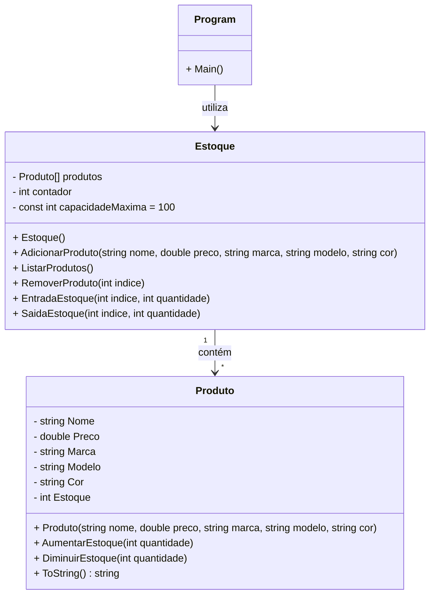

# Projeto Controle de Produtos Senac 2025

- ### Esta API demonstra o funcionamento de uma Web API de controle de caixa de uma loja de eletrônicos

## Principais Tecnologias

## Funcões
- Adiciona produto
- Adiciona características do produto
- Lista produto
- Remove produto
- Adiciona estoque
- Remove estoque

## Diagrama de Classes

